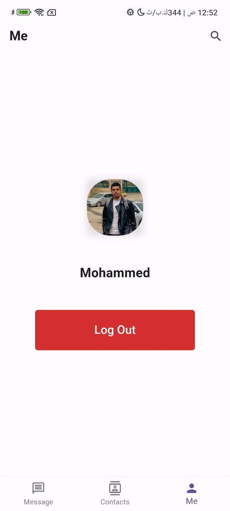
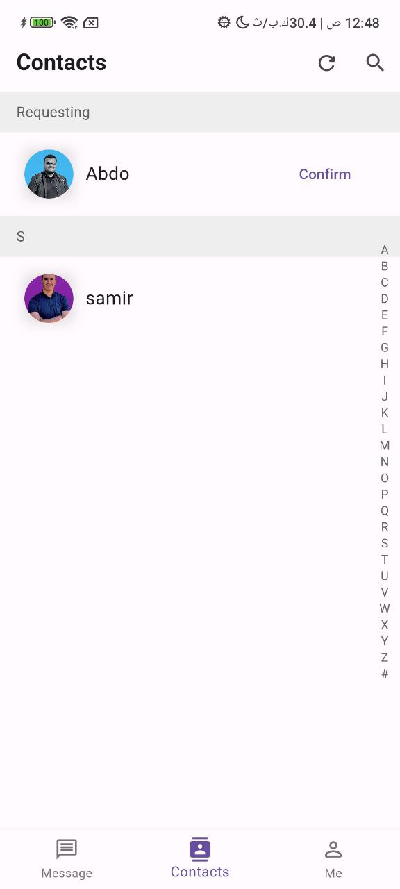
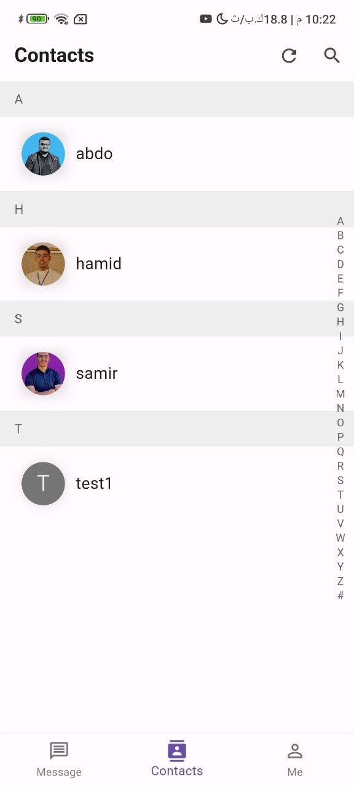
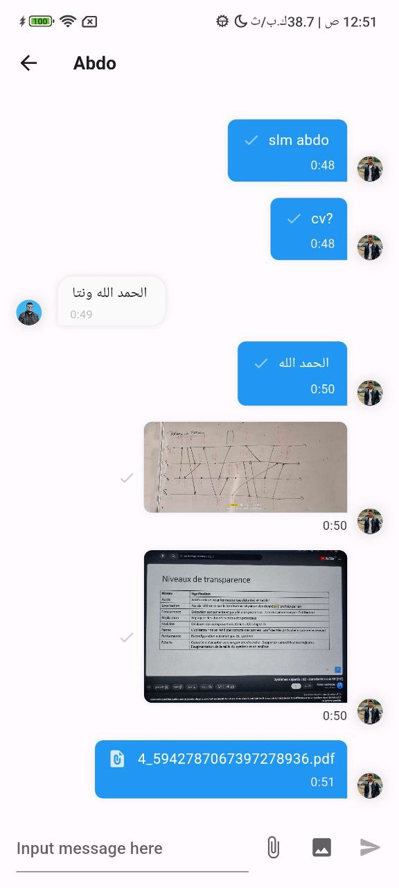
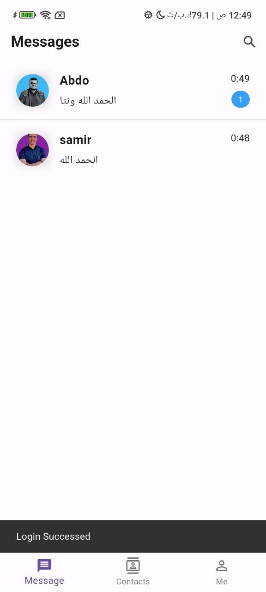
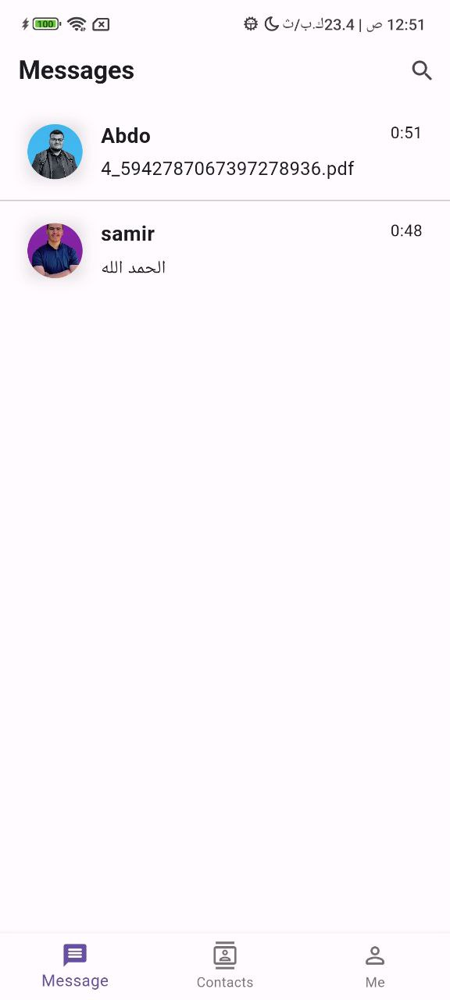

# Chat Room Application with Dart and Flutter

## Overview

This project is a robust chat room application crafted with Dart and Flutter, leveraging the power of Socket for seamless real-time communication. Whether you want to connect with friends, colleagues, or family members, this app provides a reliable platform for instant messaging.

## Team Members
-  Mohammed Azizou
([GitHub](https://github.com/abdomassoun))

-  Abdellah Massoun 
([GitHub](https://github.com/abdomassoun))

## Introduction

This application revolutionizes communication by offering users a feature-rich environment to interact in real-time. By integrating Dart and Flutter, it ensures a fluid user experience with a sleek interface.

## Key Features

- **User Authentication**: Seamlessly register, log in, and log out.
- **Persistent Login State**: Enjoy the convenience of staying logged in across devices.
- **Real-time Messaging**: Exchange messages instantly with other users.
- **Contact Management**: Search and add contacts, with the ability to accept or decline requests.
- **Cross-Device Message Sync**: Access your messages from any device seamlessly.
- **Offline Messaging**: Send messages even when the recipient is offline, mimicking SMTP behavior.
- **File Handling**: Effortlessly transfer files to and from the server.

## Socket Integration in Dart

Socket programming in Dart facilitates direct communication between nodes on a network. In this project, Socket is utilized to establish and maintain real-time connections between users within the chat room.

## Usage Instructions

1. **Run the Server**: Start the server to enable communication.
2. **Download and Install the App**: Obtain the application and install it on your device.
3. **Log In**: Enter your credentials to access the app.
4. **Add Contacts**: Search for users and add them to your contacts list.
5. **Start Chatting**: Initiate conversations with your contacts effortlessly.

*Note: Ensure that the server is operational for the application to function correctly.*

## Compilation and Deployment

To clone this project using command prompt in a Windows environment with Dart SDK configured, follow these steps:

```bash
git clone https://github.com/mohammedzizou/Chat-Room-Project-with-Socket/tree/main 
```

Configuring the server for the chat room application typically involves:

1. **Navigating to the Server Directory**: Access the server files.
2. **Installing Dependencies**: If necessary, install any required dependencies.
3. **Starting the Server**: Launch the server to enable communication.

```bash
# Navigate to the server directory
cd Server

# Install dependencies (if any)
dart pub get

# Start the server
dart run
```
## 7 Screenshots
<!-- <style>
  .screenshot-row {
    display: flex;
    justify-content: center;
    margin-bottom: 20px; /* Adjust the margin as needed */
  }
  .screenshot {
    margin-right: 10px; /* Adjust the margin between images as needed */
  }
</style> -->

<div class="screenshot-row">
  
  
 
</div>
<div class="screenshot-row">
 
 
</div>

<div class="screenshot-row">
 
  
  
</div>
Empower your communication experience with our Dart and Flutter-powered chat room application today!